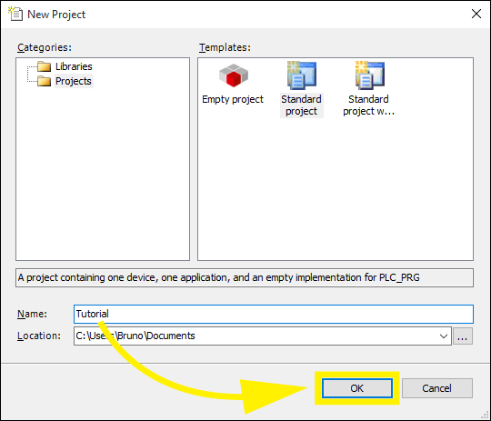
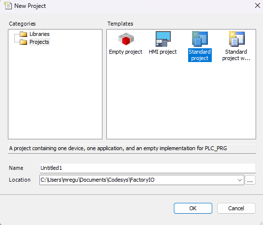
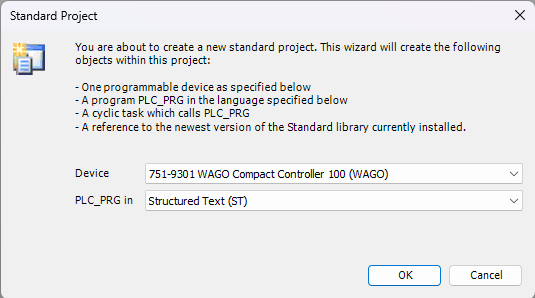
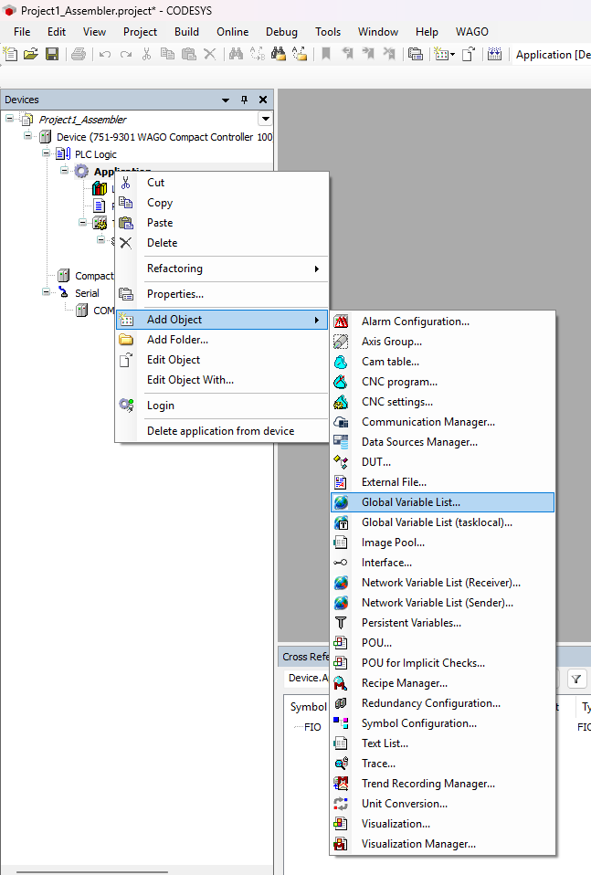
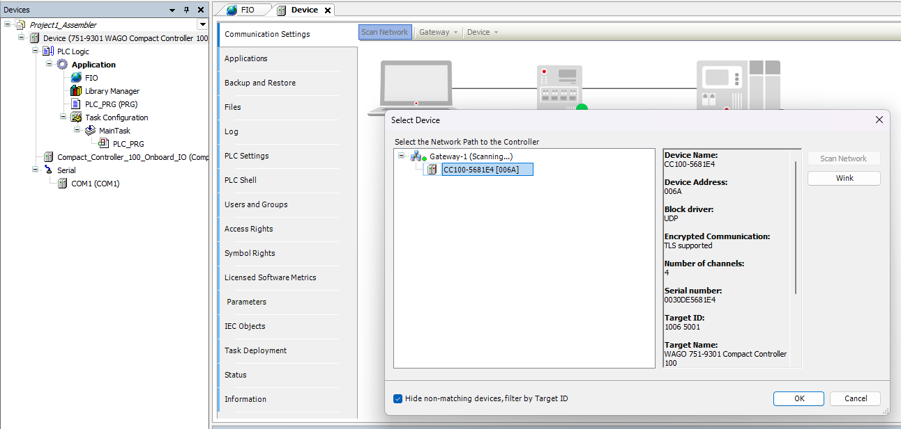
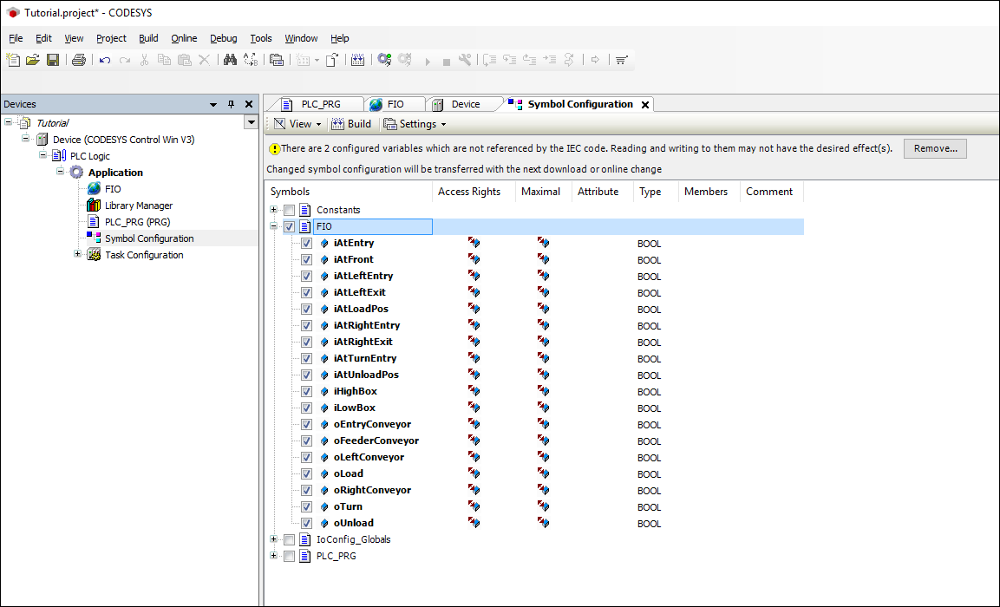
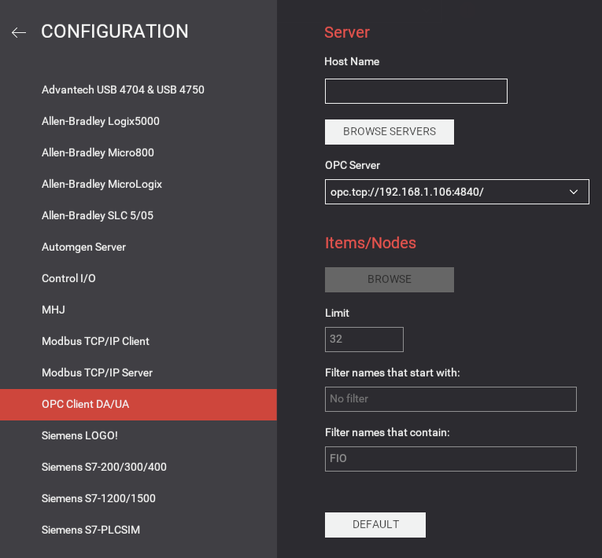
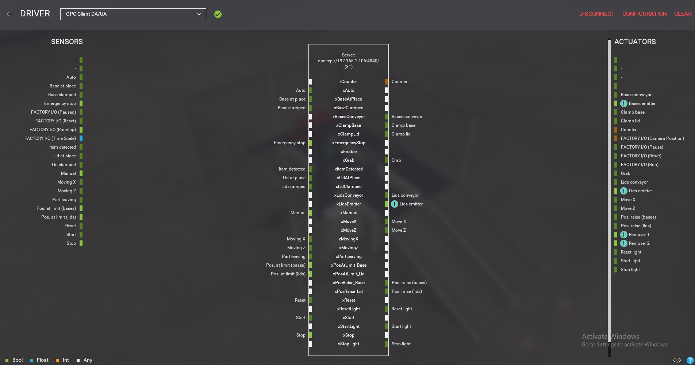

# Setting up CODESYS OPC UA comms with Factory IO

This tutorial shows how to use CODESYS together with Factory I/O through OPC UA. By following this sample you will create a new CODESYS project, configure it to work with Factory I/O and program the actual controller to control the Assembler scene.

For alternative instructions on how to program using CODESYS Control Win (SoftPlc), please use this link: [FactoryIO: CODESYS with OPC UA](https://docs.factoryio.com/tutorials/codesys/setting-up/codesys-opc-ua-sp17/)

## Creating the Project

1. Start CODESYS and create a new project



2. Select **Standard project** from the Templates list and choose a name for the project (e.g. Tutorial). Click on **OK**.



3. On a Standard Project window select the Device:
**751-9301 WAGO Compact Controller 100**
and **Structured Text(ST)** for the **PLC_PRG**. Click on **OK**



4. Right-click on **Application** and select **Add Object > Global variable list...** . Type **FIO** as the list name, click on **Add**.



5. Open the FIO list and copy and paste the following global variables. These variables will be used to exchange data between Factory I/O and CODESYS through OPC UA (these are the I/O points).

```
    VAR_GLOBAL
        xEnable             : BOOL;
        // Inputs
        xAuto 				: BOOL;
        xBaseAtPlace 		: BOOL;
        xBaseClamped 		: BOOL;
        xEmergencyStop 		: BOOL;
        xItemDetected 		: BOOL;
        xLidAtPlace 		: BOOL;
        xLidClamped 		: BOOL;
        xManual 			: BOOL;
        xMovingX 			: BOOL;
        xMovingZ 			: BOOL;
        xPartLeaving 		: BOOL;
        xPosAtLimit_Base 	: BOOL;
        xPosAtLimit_Lid 	: BOOL;
        xReset 				: BOOL;
        xStart 				: BOOL;
        xStop 				: BOOL;
        // Outputs
        xBasesConveyor 		: BOOL;
        xClampBase			: BOOL;
        xClampLid			: BOOL;
        iCounter			: INT;
        xGrab				: BOOL;
        xLidsConveyor		: BOOL;
        xLidsEmitter		: BOOL;
        xMoveX				: BOOL;
        xMoveZ				: BOOL;
        xPosRaise_Base		: BOOL;
        xPosRaise_Lid		: BOOL;
        xResetLight			: BOOL;
        xStartLight			: BOOL;
        xStopLight			: BOOL;
    END_VAR
```
> Alternatively, you can add these variables to your PLC_PRG(PLC) local variables instead of global.

6. Make sure your PLC controller is reachable on the network. Double-click on **Device (751-9301...)** in your project tree, and then on **Communication Settings**. Now, click on **Scan network...** Select the network path to the controller and click on **OK**. Note that device name can be changed by clicking on **Device > Rename active device**.



7. Now, **Right-click** on **Application** and select **Add Object > Symbol Configuration**. On the **Add Symbol Configuration** window check **Support OPC UA features**, next click on **Add**. Now, check the FIO symbols (see image below) and click on Build.



8. Next, click **Online > Login**. When prompted to download the program to the PLC, click on **Yes**.
9. Finally, click on **Debug > Start**.

## Setting up Factory IO

1. Open the **Assembler** scene and click on **File > Driver configuration**.
2. Select **OPC DA/UA** from the driver list and click on **Configuration**.
3. Type **opc.tcp://<ip_address>:4840/** on the **OPC Server** input field and press **Enter** to connect. Set "FIO" as the contain filter (see image below) - this will retrieve nodes containing "FIO" (the Global Variable List defined in CODESYS). Next, click **BROWSE**.



4. Map the sensors and actuators tags as shown in the image below.



5. Finally, close the Driver window and start the simulation (press F5).
